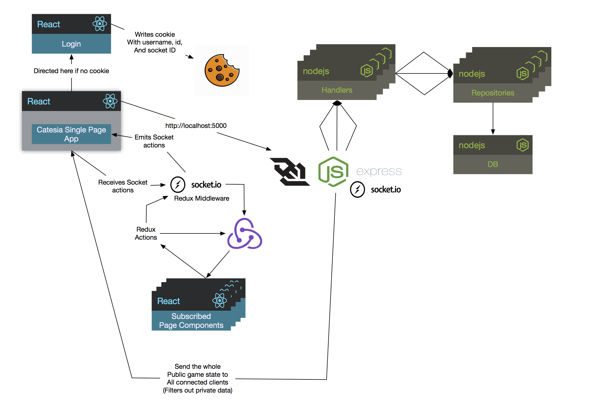
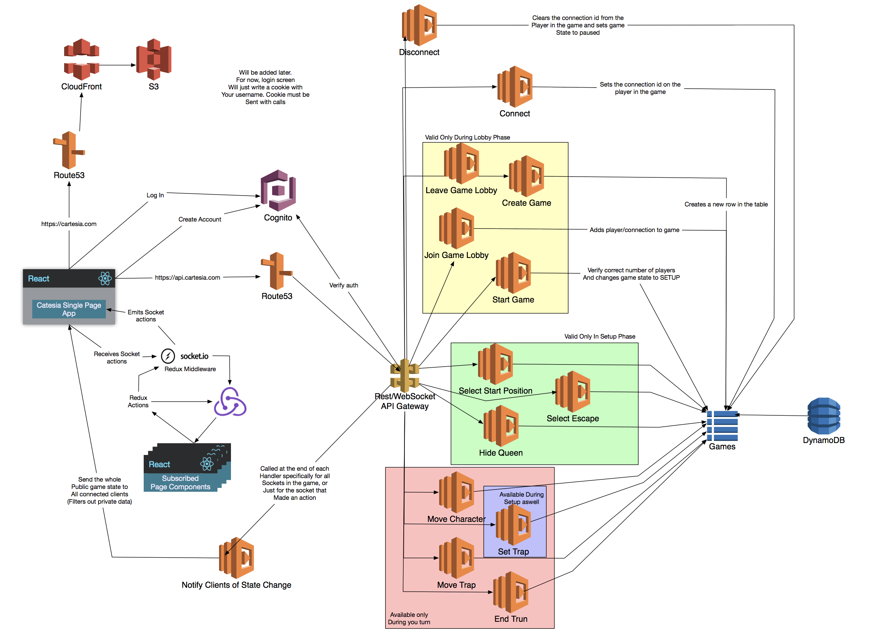
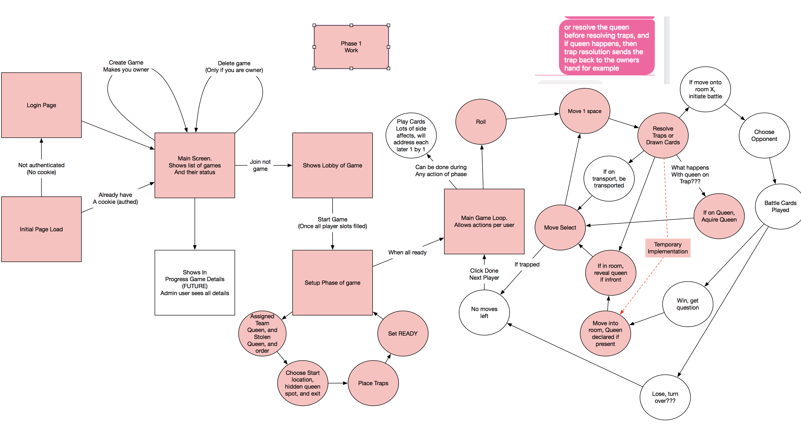

# Cartesia

A board game my fiance made. The pain points of playing with a board is that you have to hide traps and queens on spots on the board. Because this is manual, you have to write down their hidden locations and then pay close attention to the game to verify if people walk over your traps.

The initial goal of this project is to handle that via a web app. The long term goal is to make this the entire game.

## Architecture

The application is split into 2 separate pieces. A react frontend made with create-react-app, and a nodeJS backend exposing a rest interface and a socket.io server.

### Client Side

The full frontend of the app is a client side static site using react. It is meant to be built into static files and served via a CDN.

##### Authentication

Authentication right now is simple and handled via a single form that upon submission writes a cookie. The presence of this cookie is used to send the user to the login page when hitting an authenticated page without a cookie. Later on this cookie data will be sent with the requests to identify the user making the request. This isn't very secure as I could change my cookie to be that of someone elses. Long term, this will instead integrate with Auth0 or AWS Cognito.

##### State

All possible state should be placed in the global redux store. Redux should automatically handle not re-rendering the whole view when non-important state changes happen (for example, placing a trap may not have a visual representation on the board, so we won't need to re-render it).

##### Interactions with the backend

Backend interactions can be broken into 2 categories, Rest HTTP calls (1 way), and Socket events (2 ways). Rest HTTP calls should be made when validation against the attempt should be done that may result in error handling (attempt to move forward a spot, get the result of if it was successful or not). Sockets should be used for fire and forget events. NOTE: I'm not married to this, I was just thinking about this a bit ahead of time. In reality, all of our calls probably need backend validation.

It just seems that handling a rest call

> a container calls a redux action, caught by a saga, calls the backend api, gets a response + status code, fires a new redux action to put the data into the redux store

vs handling a socket

> container calls a redux action that is caught by a socket.io redux middleware. we emit an event to the backend, but then somewhere else in our middleware we will have to listen for the response event

The socket has a more disjunct response handling. We may result in using sockets for all communication, or most calls to the backend are rest calls, and we just get socket pushes for state changes.

Rest HTTP calls will be done via Redux Saga's as a middleware.

Socket message emitting and recieving are handled via the socket.io.js middleware.

Eventually, 1 or 2 service client objects should be made to handle the backend communication to have a central place to enhance with things like auth, logging, error handling, and retries.

##### UI Code

The UI code should be split into 3 main sections.
* Components - Pure react components with no state or side affect code. These specifically should be small, maybe reusable UI components. Could be hosted by react storybook and worked on in isolation from redux and react-router.
* Pages - Pure react components with no state or side affect code. These specifically should be a set of components pulled together to make a single unified view for 1 route. Could be hosted by react storybook and worked on in isolation from redux and react-router.
* Containers - Following the redux container/component pattern, these are our glue components that hook up pages to our redux state and dispatch store

### Server Side

The server side code right now is a simple nodeJS express server hosting a rest HTTP api and a socket.io server. It should be built in a modular way with the end goal of converting it to an AWS serverless system. The current system is for quick early iteration so we don't deal with AWS complexities before even having something working to show.

##### DB

The current DB implementation is a simple in memory json store. The repository modules should be the only thing interacting with it directly in order minimize fallout if we switch to use a real DB or other persistent storage.

##### Models

These are simple classes for us to deserialize our db models into. They are not meant to be an ORM type interface to the DB. Rather, we create an object out of the data, and it can provide calculations or specific views of the data. They should be read only ideally to get this affect.

##### Repositories

These modules are our interface to our DB. They should provide all the read and write interactions. When possible, they should deal with our models and not raw JSON directly unless persisting/reading from the DB.

##### Handlers

There should pretty much be a 1-1 mapping of handlers to Rest/WebSocket interactions. These handlers should receive the data we get from our api calls and sockets, and if needed, should return the data required that would need to be emitted to Sockets, and the data needed to determine which sockets to emit to (like the players currently in a game). If we move to a serverless setup, each handler would become a separate lambda function. Because of this, these handlers should have no dependency on Socket.io directly.

##### Server + openSockets

These files are our outermost module that glues our business logic code to the current implementation of express and socket.io. If we move to a serverless module, this would be broken into glue code for each handler to the AWS API Gateway Lambda event.

### Architecture Diagrams

The following diagrams are made with omnigaffle (source files included) and screenshotted for others to view. They are a work in progress and details can be added as needed.

##### Current Architecture

The current implemntation has a backend of a simple nodeJS express server with socket.io. It uses an in memory DB.

##### Possible Serverless Architecture

It would be cool at a later date to deploy this with serverless technologies. Because of that, the backend is being architected in a modular way that could be decomposed into this

##### Game State Diagram

This is a work in progress, but it should be a flow chart of the state a user goes through as playing the game.

### Data and Thoughts Dump

##### Data

* teams
  * Stolen Queen (PRIVATE TO YOU)
  * Team Queen
  * Players
    * Connection ID (PRIVATE TO YOU)
    * Cards  (PRIVATE TO YOU)
    * Name
    * Trapped Status
    * Has queen
* Placed traps  (PRIVATE TO YOU)
* Hidden queen locations  (PRIVATE TO YOU)
* Player locations
* Game State (state machine status)
* Battling Cards (cards in your suite minus your queen) (PRIVATE FROM EVERYONE)
* Game Owner

##### Calculations

* All Queens Hidden?
* All Players Positioned?
* Carry count (has queen)

##### Actions

* Sign in
* Create Game
* Join Game
* Start Game
* Hide Queen
* Select Starting Position
* Move Character
* Set Trap
* Move Trap
* Turn Done
* Pick exit

## TODO's
* Random small todo statements strewn about the app
* TODO: Add more TODO's